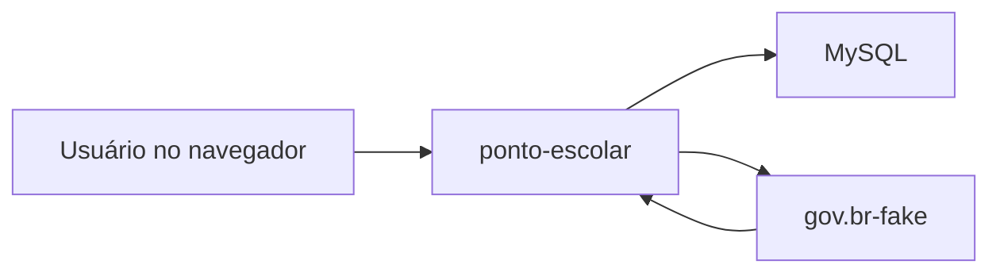
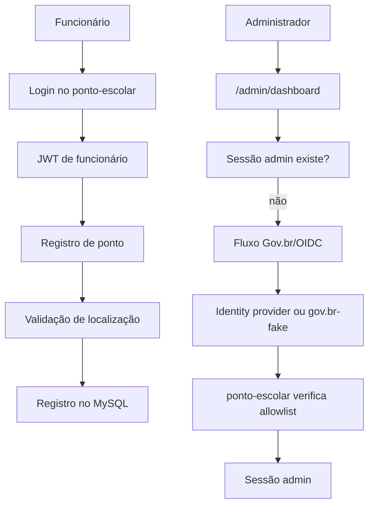

# Visão geral da arquitetura

Este documento explica como o projeto está organizado por dentro. Ele não substitui o [manual de instalação e uso](./MANUAL.md).

## Componentes principais



| Componente | Responsabilidade |
| --- | --- |
| `ponto-escolar` | Sistema principal: páginas, APIs, regras de negócio, banco, ponto, funcionários, relatórios e autorização admin. |
| `gov.br-fake` | Simulador local do provedor de identidade. Autentica uma identidade fictícia e devolve dados via `/userinfo`. |
| MySQL | Armazena funcionários, cargos, logins de funcionários e registros de ponto. |
| Navegador | Exibe as páginas HTML e envia requisições para as rotas HTTP. |

## Padrão interno do `ponto-escolar`

O sistema principal segue MVC com camada de services:

| Camada | Responsabilidade |
| --- | --- |
| `routes` | Define URLs e conecta middlewares aos controllers. |
| `controllers` | Recebe `req` e `res`, chama services e monta respostas HTTP. |
| `services` | Concentra regras de negócio, validações e integrações externas. |
| `models` | Concentra SQL e acesso ao banco. |
| `middlewares` | Protege rotas, valida entrada, autentica usuário e aplica limites. |
| `utils` | Reúne funções pequenas, como CPF, localização, tokens, PKCE e erros. |
| `views` | Guarda páginas HTML servidas pelo Express. |
| `public` | Guarda CSS, JavaScript, imagens, fontes e ícones. |

## Separação entre os projetos

O `gov.br-fake` não deve conter regra de permissão administrativa. Ele apenas simula identidade. A decisão final de acesso ao dashboard fica no `ponto-escolar`, como detalhado em [006.md](./006.md).

Essa separação evita que regras falsas de demonstração contaminem o sistema real.

## Estrutura resumida

```text
ATestaPonto/
  docs/
  ponto-escolar/
    src/
      config/
      controllers/
      middlewares/
      models/
      routes/
      scripts/
      services/
      utils/
    public/
    views/
  gov.br-fake/
    src/
      config/
      controllers/
      models/
      repositories/
      routes/
      services/
      utils/
    public/
    views/
```

## Fluxo de alto nível



## Decisões importantes

- O front-end não decide permissão administrativa.
- O login de funcionário é separado do login administrativo.
- O QR Code é um atalho para a tela de ponto, não uma credencial.
- O servidor usa CommonJS (`require` e `module.exports`).
- A configuração sensível vem de `.env`.
