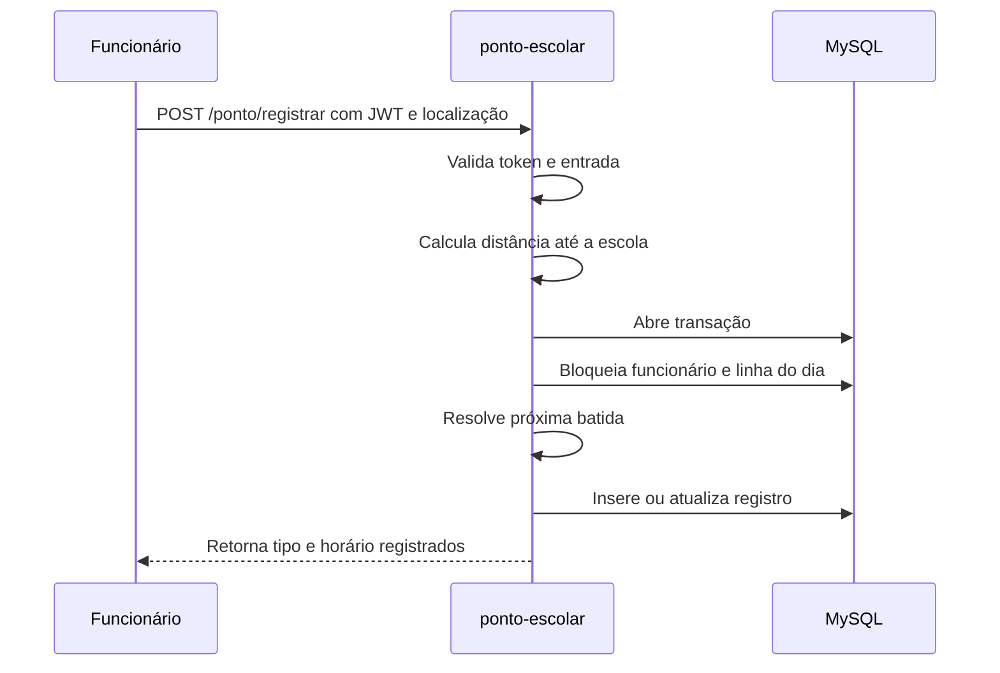

# Funcionário e registro de ponto

Este documento explica o fluxo técnico do funcionário. Para o passo a passo com tela e imagens, consulte o [manual](./MANUAL.md).

## Login do funcionário

O funcionário pode entrar usando CPF ou e-mail e senha. O back-end:

1. normaliza o identificador recebido;
2. busca o funcionário no banco;
3. compara a senha informada com o hash salvo;
4. verifica se o funcionário está ativo;
5. gera um JWT com `role: "funcionario"`;
6. registra o evento de login no log de auditoria da aplicação.

Falhas de usuário inexistente e senha incorreta retornam mensagem genérica. Isso evita revelar se um CPF ou e-mail está cadastrado.

## Token de funcionário

O token de funcionário é enviado nas requisições protegidas pelo cabeçalho:

```http
Authorization: Bearer <token>
```

O middleware valida o JWT usando `JWT_SECRET`, confirma o papel `funcionario` e consulta novamente o funcionário no banco. Essa nova consulta impede que uma conta desativada continue usando um token antigo.

## Registro da batida



## Ordem das batidas

O sistema determina automaticamente a próxima batida olhando os horários já existentes no registro do dia.

| Estado atual | Próxima batida |
| --- | --- |
| Nenhum horário registrado | `ENTRADA` |
| Entrada registrada | `SAIDA_ALMOCO` |
| Saída de almoço registrada | `VOLTA_ALMOCO` |
| Retorno do almoço registrado | `SAIDA` |
| Quatro horários registrados | Bloqueia nova batida |

## Validação de localização

A localização enviada precisa conter números válidos para latitude e longitude. Depois disso, o sistema compara o ponto informado com:

- `SCHOOL_LATITUDE`;
- `SCHOOL_LONGITUDE`;
- `ALLOWED_RADIUS_METERS`.

Essas variáveis são configuradas no `.env` do `ponto-escolar`.

## Persistência

As batidas ficam na tabela `registro_de_pontos`, uma linha por funcionário e data. As quatro batidas ficam em colunas da mesma linha:

- `entrada`;
- `saida_almoco`;
- `retorno_almoco`;
- `saida`.

O banco possui restrição única para impedir mais de uma linha para o mesmo funcionário na mesma data.

## Rotas relacionadas

| Método | Rota | Função |
| --- | --- | --- |
| `POST` | `/ponto/login` | Login do funcionário. |
| `POST` | `/ponto/registrar` | Registra a próxima batida. |
| `POST` | `/ponto/bater` | Alias para registrar a próxima batida. |
| `POST` | `/api/pontos/login` | Mesmo fluxo via prefixo de API. |
| `POST` | `/api/pontos/registrar` | Mesmo fluxo via prefixo de API. |
| `POST` | `/api/pontos/bater` | Mesmo fluxo via prefixo de API. |
