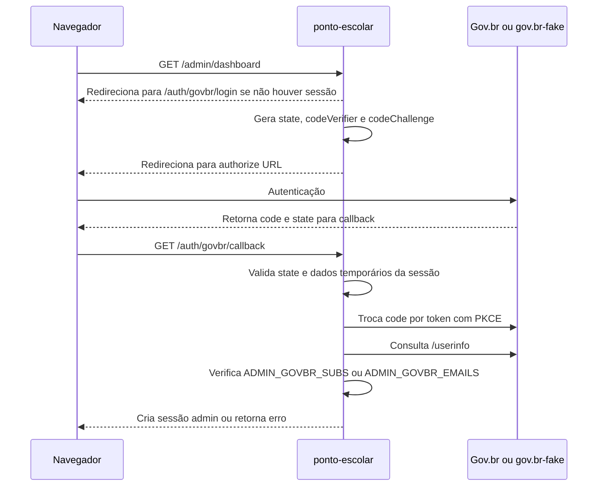

# Autenticação Gov.br e autorização admin

Este documento é a fonte principal sobre autenticação administrativa. Para regras gerais de segurança, consulte [008.md](./008.md).

## Conceito central

Autenticação e autorização são coisas diferentes:

| Conceito | No projeto |
| --- | --- |
| Autenticação | Gov.br, ou `gov.br-fake`, confirma quem é o usuário. |
| Autorização | `ponto-escolar` decide se essa identidade pode acessar o painel. |

Um access token válido não significa permissão administrativa.

## Fluxo administrativo

## O que o `ponto-escolar` controla

O sistema principal controla:

- geração do `state`;
- geração do `codeVerifier`;
- cálculo do `codeChallenge`;
- armazenamento temporário desses dados na sessão;
- validação do callback;
- troca do authorization code por token;
- consulta de `/userinfo`;
- verificação da allowlist administrativa;
- criação de `req.session.admin`.

## O que o `gov.br-fake` simula

O simulador local implementa:

- tela demonstrativa de login;
- endpoint `/fake-govbr/authorize`;
- emissão de authorization code;
- validação de PKCE `S256`;
- endpoint `/fake-govbr/token`;
- endpoint `/fake-govbr/userinfo`;
- armazenamento em memória de sessões, códigos e tokens.

Ele não decide se alguém é admin do ATestaPonto.

## Allowlist administrativa

A autorização do admin usa uma lista configurada no `.env`:

| Variável | Uso |
| --- | --- |
| `ADMIN_GOVBR_SUBS` | Lista de identificadores `sub` autorizados. |
| `ADMIN_GOVBR_EMAILS` | Lista de e-mails autorizados. |

Pelo menos uma dessas listas precisa conter valor.

## Rotas principais

| Método | Rota | Responsabilidade |
| --- | --- | --- |
| `GET` | `/auth/govbr/start` | Redireciona para `/auth/govbr/login`. |
| `GET` | `/auth/govbr/login` | Inicia o fluxo OAuth/OIDC. |
| `GET` | `/auth/govbr/callback` | Processa `code` e `state`. |
| `GET` | `/auth/govbr/logout` | Encerra a sessão administrativa. |
| `POST` | `/auth/govbr/logout` | Encerra a sessão administrativa. |

## Regras que não devem ser quebradas

- Nunca enviar `access_token` pela URL.
- Nunca liberar dashboard apenas porque existe token.
- Nunca aceitar perfil vindo do front-end como prova de admin.
- Nunca colocar regra fake de admin dentro do `gov.br-fake`.
- Sempre iniciar o login administrativo por `/auth/govbr/login`.
