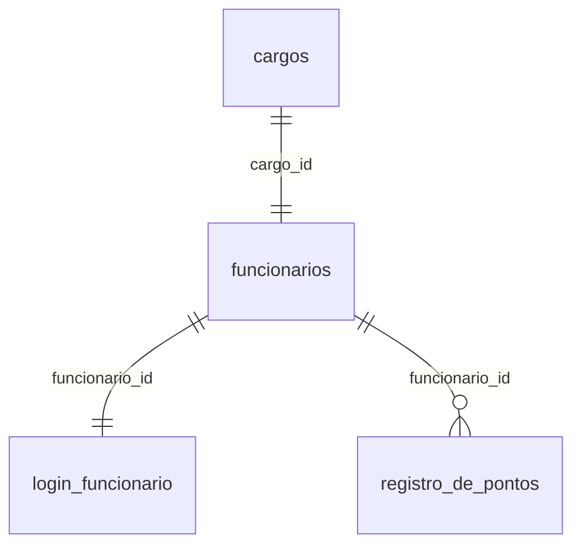

# Banco de dados

Este documento descreve o banco usado pelo `ponto-escolar`. O passo a passo de criação e execução está no [manual](./MANUAL.md).

## Banco

O projeto usa MySQL. O arquivo de schema encontrado no estado atual é:

```text
ponto-escolar/ponto (2).sql
```

O script `npm run db:init` procura o schema nesta ordem:

1. `ponto-escolar/database/schema/ponto.sql`;
2. `ponto-escolar/ponto (2).sql`;
3. `ponto-escolar/ponto.sql`.

## Tabelas principais

| Tabela | Finalidade |
| --- | --- |
| `cargos` | Guarda o cargo e os horários associados ao funcionário. |
| `funcionarios` | Guarda dados cadastrais do funcionário e status ativo/inativo. |
| `login_funcionario` | Guarda credencial do funcionário, hash de senha e informações de primeiro acesso. |
| `registro_de_pontos` | Guarda as batidas de ponto por funcionário e data. |

## Relacionamentos



## `cargos`

Campos mais importantes:

| Campo | Uso |
| --- | --- |
| `id` | Identificador do cargo. |
| `cargo` | Tipo do cargo: `FUNCIONARIO`, `INSPETOR` ou `PROFESSOR`. |
| `entrada` | Horário esperado de entrada. |
| `saida_almoco` | Horário esperado de saída para almoço. |
| `retorno_almoco` | Horário esperado de retorno do almoço. |
| `saida` | Horário esperado de saída. |

## `funcionarios`

Campos mais importantes:

| Campo | Uso |
| --- | --- |
| `id` | Identificador do funcionário. |
| `cargo_id` | Relação com `cargos`. |
| `cpf` | Identificador usado no login, armazenado sem máscara. |
| `email` | E-mail do funcionário. |
| `nome` | Nome exibido no sistema. |
| `telefone` | Telefone opcional. |
| `ativo` | Controla se o funcionário pode registrar ponto. |
| `desativado_em` | Data de desativação, quando aplicável. |

## `login_funcionario`

Campos mais importantes:

| Campo | Uso |
| --- | --- |
| `funcionario_id` | Relação com `funcionarios`. |
| `senha_hash` | Hash da senha do funcionário. |
| `primeiro_acesso` | Indica se a senha temporária ainda precisa ser trocada. |
| `ultimo_login_em` | Último login registrado. |

## `registro_de_pontos`

Campos mais importantes:

| Campo | Uso |
| --- | --- |
| `funcionario_id` | Funcionário dono das batidas. |
| `data_referencia` | Dia ao qual as batidas pertencem. |
| `entrada` | Primeira batida. |
| `saida_almoco` | Segunda batida. |
| `retorno_almoco` | Terceira batida. |
| `saida` | Quarta batida. |

A tabela possui chave única em `funcionario_id` + `data_referencia`, impedindo duas linhas para o mesmo funcionário no mesmo dia.

## Observações de consistência

O código atual usa aliases para compatibilidade em alguns pontos. Por exemplo, a regra de ponto trabalha com o nome lógico `voltaAlmoco`, enquanto o schema usa a coluna `retorno_almoco`.

Ao evoluir o schema, mantenha os nomes esperados pelos models ou atualize os models junto. Banco e código precisam ser tratados como contrato único.
